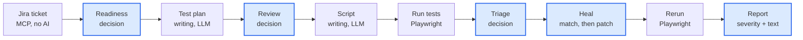
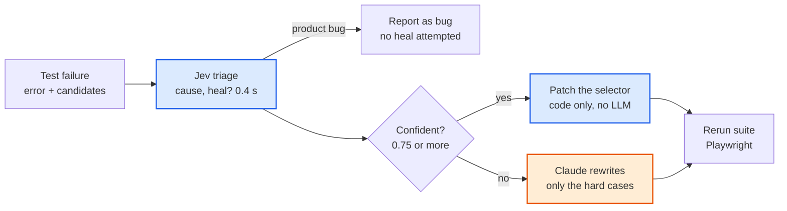
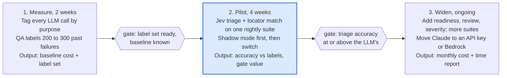

# Jev + LLM Test Automation POC

5 October 2026 · Priyam Bhatt · Markdown export of the POC document (also at https://claude.ai/code/artifact/947a64ac-9d78-4f3d-8de3-2d4e3b759958)

## Executive summary

Replacing the LLM with Jev for the decision steps of our test automation agent made the same job 3.4 times cheaper and 1.8 times faster, with an identical result: 4 of 4 tests passing after one self-heal.

- We built two agents that do the same work: read a Jira story, write test cases, generate a Playwright script, run it, triage and heal a failure, report.
- Agent A uses Claude (an LLM) for every step. Agent B uses Jev, a System One model from TypeSafe AI, for every decision and Claude only for writing.
- On the first real run Agent A cost $0.270 and took 84.5 s. Agent B cost $0.078 and took 46.9 s.
- The saving comes from the steps that repeat on every failure: triage, locator matching and review. Those are exactly the steps a nightly suite runs hundreds of times.
- Recommendation: run a two-week pilot on one real regression suite, measure triage and heal accuracy against QA labels, then roll Jev into the failure-handling path first.

Code: [Raghav-droi/Jev_Plus_LLM_Automation_System](https://github.com/Raghav-droi/Jev_Plus_LLM_Automation_System).

## The problem we are solving

AI-driven test automation is expensive because the agent asks a large language model to make dozens of small decisions, and each one costs seconds and cents.

Our target system reads a Jira story, writes test cases, generates a Playwright script, runs it, and heals the script when a test fails. Two kinds of work are mixed in that pipeline:

- **Writing**: test cases, the script, a healed script. This happens once per story. It genuinely needs an LLM.
- **Deciding**: is the story ready, is this case automatable, why did this test fail, which element replaced the old one, should we retry. This happens on every run and every failure. It does not need prose.

Today both kinds go to the same LLM. In a nightly suite of a few hundred tests the deciding work dominates: every failure triggers a triage call with logs and a DOM snapshot, often followed by a healing call and a rerun. The writing happened once; the deciding never stops. That is the cost we set out to cut.

## What Jev is

Jev is a model from [TypeSafe AI](https://typesafe.ai/blog/introducing-system-one-models-and-jev) that answers questions with typed values and probabilities instead of text. It was released in limited early access on 15 September 2026.

TypeSafe calls it a **System One** model, after Daniel Kahneman's term for fast, intuitive thinking. A chat LLM imitates System Two: slow, step-by-step reasoning written out as text. Jev makes one quick judgement and returns a number.

**How you talk to it.** A request has two parts: the *state*, which is the situation written as plain text or JSON, and the *questions*, each with a fixed set of allowed answers. There are three question types:

| Type | Asks | Returns | Example from our project |
| --- | --- | --- | --- |
| Choice | Pick one option from a list you define (up to 255) | The chosen option, its confidence, and a probability for every option | Why did this test fail: product bug, flaky, locator changed, environment, test data |
| Noul | Is this statement true? | A probability from 0 to 1 | Should the test script be healed automatically? |
| Score | Where on a scale? | A score, possibly fractional, with confidence | How risky is a defect in this feature, 1 to 5 |

**How it computes the answer.** Jev is still a transformer, the same network family as an LLM. The difference is the last layer. An LLM scores every possible next word, picks one, and runs again, hundreds of times. Jev gives one score to each allowed option and squashes those scores so they add up to 1. That is the probability distribution. One pass, all questions answered together, no loop.

**Why the probabilities can be trusted.** TypeSafe trains Jev with a method it calls Reinforcement Learning for Calibrated Decisions. The reward is honest probabilities, not pleasing text. A calibrated 0.8 means the model is right about 80 times in 100, which lets code set thresholds: act above 0.9, ask a human below.

**What it cannot do.** It cannot write text or code. It reads instructions literally and struggles with counting, date arithmetic and very long inputs. Pricing is $0.042 per million input tokens; output is free. Reported latency is 70 to 500 ms per call.

## Jev versus an LLM

The two are not rivals. An LLM writes; Jev decides. The table shows why we want both in one system.

|  | LLM (Claude, GPT, Gemini) | Jev |
| --- | --- | --- |
| Output | Free text or code, one token at a time | Typed values: a choice, a yes/no probability, a score |
| How many passes per answer | One per token, often hundreds | One for all questions together |
| Latency per call | 3 s to minutes | 70 to 500 ms (we measured 0.34 to 0.58 s) |
| Price | $2 to $10 per million input tokens, output 5x more | $0.042 per million input tokens, output free |
| Can it invent an answer | Yes, it can hallucinate or return malformed output | No, the answer must be one of the options you listed |
| Tells you how sure it is | Only if you ask, and the number is not calibrated | Always, as a calibrated probability on every option |
| Good at | Writing test cases, scripts, reports, explanations | Classify, route, score, pick from a list, gate an action |
| Bad at | Being cheap or fast on repeated small decisions | Writing anything, counting, date maths, very long inputs |
| In our pipeline | Test plan, Playwright script, healing when Jev is unsure | Readiness, review, failure triage, element matching, severity |

The practical rule we used: **if the step produces words, keep the LLM. If the step produces a label, a yes/no or a number, give it to Jev.**

## Our POC: one pipeline, two brains

We built one pipeline and plugged two different decision-makers into it, so the only variable in the comparison is who answers the decision steps.



*Blue boxes are decision steps: Claude in Flow A, Jev in Flow B. White boxes are writing (Claude in both) or plain code.*

The top row happens once per story. The bottom row repeats on every run and loops on every failure. The highlighted boxes are the decisions; everything else is either writing, which stays with Claude in both flows, or plain code.

**The demo task.** A Jira story for the login page of [saucedemo.com](https://www.saucedemo.com), a public practice site, with four acceptance criteria: valid login lands on Products, wrong password shows an error, empty fields show an error, locked user is blocked. Both agents read it through the open-source `mcp-atlassian` MCP server (or a local JSON copy for offline runs).

**The fault injection.** A correct script passes on the first run and the healing path never executes. To test it, the runner renames one selector in the generated script after it is written, `data-test="username"` becomes `data-test="username-v2"`. This simulates the UI changing after the test was written, which is the real-life cause of most self-healing work. Both agents receive the same broken selector.

## Flow A: the LLM-only agent

Agent A sends every step to Claude Opus 5.5 and asks for a structured JSON answer each time. On the demo run it made 7 calls.

1. **Readiness.** Claude reads the ticket and returns: ready or not, has acceptance criteria, UI or API test, risk 1 to 5, and a paragraph of reasoning.
2. **Test plan.** Claude extracts the acceptance criteria and writes 3 to 5 test cases with steps and expected results.
3. **Review.** Claude judges every case: automatable, covers its criterion, priority P1 to P3, duplicate of another case.
4. **Script generation.** Claude writes the Playwright file, using a list of real elements we scraped from the target page so the selectors are correct.
5. **Run.** Playwright executes the tests. No AI.
6. **Triage.** On a failure, Claude reads the error, the failed locator and the candidate elements and classifies the cause in a paragraph.
7. **Heal.** Claude rewrites the whole script file to fix it, then the suite reruns.
8. **Report.** Claude writes a Markdown report with tables, the healing story and a verdict.

Each call takes 6 to 14 seconds and costs 1 to 6 cents. Steps 1, 3, 6, 7 and 8 produce a decision wrapped in prose. The prose is pleasant to read but the code only uses the label.

## Flow B: the hybrid agent, where Jev is used and why

Agent B keeps Claude for the two writing steps and gives every decision to Jev. On the demo run it made 2 Claude calls and 4 Jev calls.



*Blue: Jev. Orange: Claude. White: plain code.*

The pattern is the same at every decision: ask Jev, read the probability, act if it is above a threshold, otherwise fall back to Claude. The threshold is one setting, `JEV_CONFIDENCE`, set to 0.75 for the demo.

**The Jev questions we ask at each step**

| Step | Questions sent to Jev | Why Jev and not Claude |
| --- | --- | --- |
| Readiness | Noul: story is clear enough to test. Noul: has acceptance criteria. Choice: UI, API or both. Score: risk 1 to 5. | Four labels, no prose needed. One call, 0.4 s. |
| Review | For every test case, in one call: Noul automatable, Noul covers its criterion, Noul duplicate, Choice priority P1 to P3. | 16 questions for 4 cases ride in one request. Cost does not grow with the number of questions. |
| Triage | Choice: product bug, flaky, locator changed, environment, test data. Noul: should the script be healed. | Runs on every failure, every night. This is the highest-volume decision in the system. |
| Locator match | Choice over the interactive elements found on the page, plus a 'none' option: which one is the element the old selector pointed to. | Matching is a selection problem, not a writing problem. If Jev is confident, code swaps the selector and no LLM runs. |
| Report | Choice: severity of each remaining failure. Prose from a template. | Severity is a label. The narrative is optional for a machine-readable report. |

**Why the fallback matters.** Jev cannot rewrite code. When the page structure genuinely changed, or Jev's top pick is below the gate, the failure goes to Claude exactly as in Flow A. The hybrid is never worse than Flow A on a hard case; it is only cheaper on the common ones. On the demo run Jev picked the replacement element at confidence 0.79, so Claude was not called for healing at all.

## Results of the first real run

Same ticket, same broken selector, same final outcome: the hybrid agent finished in 46.9 s for $0.078, the LLM-only agent in 84.5 s for $0.270.

|  | LLM only | Hybrid with Jev |
| --- | --- | --- |
| Wall time | 84.5 s | 46.9 s |
| Cost, API-equivalent | $0.270 | $0.078 |
| Claude calls | 7 | 2 |
| Jev calls | 0 | 4, total 1.5 s, $0.0002 |
| Runs needed | 2 | 2 |
| Final result | 4 pass, 0 fail | 4 pass, 0 fail |

**Cost per step in US cents, one real run** (LLM only 27.0 cents in total, hybrid 7.8 cents)

| Step | LLM only | Hybrid with Jev |
| --- | --- | --- |
| Readiness | 1.22 | under 0.01 (Jev) |
| Test plan | 4.30 | 2.62 (Claude) |
| Review | 3.06 | under 0.01 (Jev) |
| Script | 5.48 | 5.19 (Claude) |
| Triage | 2.28 | under 0.01 (Jev) |
| Heal | 4.16 | under 0.01 (Jev + code patch) |
| Report | 6.48 | 0 (template) |

Source: `results/20261005-013509/comparison.md`.

The two writing steps, test plan and script, cost about the same in both agents, as they should. Every decision step dropped from several cents and 6 to 12 seconds to a fraction of a cent and under half a second.

**What was identical.** Both agents classified the failure as a locator change and chose to heal. Both ended with the same four tests passing. Jev returned the category with probability 1.0 and the should-heal answer at 0.84.

**What differed.** Claude rewrote the whole script file to heal (10.4 s, 4.2 cents). Jev picked the replacement element at confidence 0.79, just above the 0.75 gate, and code swapped one string (0.3 s, under 0.01 cents). The LLM-only report is a well-written document with tables and reasoning; the hybrid report is a plain template. That is a real trade-off, not a free win.

**Caveats on these numbers.**

- One run. Claude's writing steps vary run to run; repeat 3 to 5 times and use medians before quoting figures.
- Claude was called through the Claude Agent SDK using a subscription login, which adds a few seconds of process start per call. Both agents pay it, but the LLM-only agent makes 7 calls to the hybrid's 2, so the time gap is somewhat inflated. The cost gap is not affected.
- Costs are API-list-price equivalents reported by the SDK, not what was billed.

## What this means at real-project scale

On a nightly regression suite the decision steps run hundreds of times a month, so the per-failure saving measured in the demo compounds into roughly an 80 percent cut in the AI cost of failure handling and a 5x faster heal loop.

**Assumptions, taken from the measured run.** Per failure the LLM-only flow spends one triage call ($0.023, 6.6 s) and one heal call ($0.042, 10.4 s). The hybrid flow spends two Jev calls ($0.0001, 0.7 s) and falls back to a Claude heal on 30 percent of failures, a deliberately cautious guess. Per story, readiness plus review costs $0.043 with the LLM and $0.0001 with Jev. Writing steps are the same in both and are left out.

| Per 1,000 failures | LLM only | Hybrid with Jev | Saving |
| --- | --- | --- | --- |
| AI cost of triage and heal | $65 | $13 | 80 percent |
| Model time in the loop | 4.7 hours | 0.9 hours | 3.8 hours |
| Calls that can hallucinate a wrong fix | 2,000 | 300 | 85 percent fewer |

**A concrete team.** One product with 300 UI tests, run nightly, an 8 percent failure rate after UI changes, and 40 stories a month. That is 720 failures a month. LLM-only decision cost is about $50 a month and 3.4 hours of model time; the hybrid is about $9 and 40 minutes. Across 20 such suites the difference is roughly $800 a month and 55 hours of pipeline time.

**Where the saving grows.**

- More failures per night: UI-heavy products, frequent releases, flaky environments.
- More questions per decision: Jev answers 16 review questions in one call for the price of one.
- Pipelines that currently send full DOM dumps to the LLM on every failure. Jev forces a trimmed input, which is cheaper on both sides.

**Where it does not.**

- Script generation and genuine rewrites still cost LLM money. A product with constant structural UI changes keeps the fallback busy.
- Very stable suites with 1 percent failures save little in absolute dollars. The gain there is speed and the confidence number, not cost.
- If most failures are real bugs that need a human anyway, the heal saving disappears but the triage saving stays.

## Risks and limitations

The biggest open question is whether Jev's confidence numbers hold up on our own failures; everything else is manageable engineering.

| Risk | Why it matters | How we handle it |
| --- | --- | --- |
| Calibration unproven on our data | The whole design rests on 0.8 meaning 80 percent right. TypeSafe's accuracy figures are self-reported and measured as agreement with other models, not ground truth. | Label 200 to 300 past failures with QA and measure Jev against them before lowering the gate. Start at 0.9. |
| Early access product | The SDK is at version 0.7; the API may change, and access is by waitlist. | All Jev calls go through one 60-line wrapper. Swapping it is a day's work. |
| Template heal covers one failure type | Code can only swap a selector. Structural page changes, new flows and real bugs still go to Claude or a human. | Expected. The hybrid is never worse than LLM-only on hard cases; measure the fallback rate. |
| Report quality drops | The template report is plain. Stakeholders may want the narrative. | Keep one LLM call for the final report if wanted; it is 6 cents per story, not per failure. |
| Jev needs small, clean inputs | It struggles with long context, counting and date maths. Sending a full DOM defeats it. | The runner pre-extracts the error, the failed locator and up to 40 candidate elements. That extractor is most of the real work. |
| Numbers are from one run | Writing steps vary 20 to 40 percent between runs. | Repeat each configuration 3 to 5 times; report medians. |
| Subscription auth in the demo | The demo calls Claude through a personal Claude Code login, which is fine for a POC but not for a shared system. | Production uses an API key or Bedrock or Vertex; one line in the LLM wrapper. |

## How we would use this in production

Start with the failure path, because that is where the volume is, and only move a decision to Jev after it has beaten the LLM on our own labelled data.



**Success criteria for the pilot.** Jev's triage category agrees with the QA label at least as often as Claude's does. The template heal fixes at least half of locator failures without an LLM call. Decision cost per failure falls by 70 percent or more. No increase in wrong heals, measured as reruns that pass on a changed script but fail human review.

**Design rule that makes this safe.** Every decision in the code goes through one interface with three interchangeable backends: Jev, Claude with structured output, and plain rules. Shadow mode means Jev answers alongside Claude for two weeks without acting, so we get the accuracy numbers before anything changes in production.

## What the team needs to learn and have

Most of the skills are ones a QA automation team already has; the new part is thinking in probabilities and gates instead of yes/no answers.

**Skills**

- Playwright locators, especially role and test-id based ones. Fewer brittle selectors means less healing in the first place.
- Writing a Jev question well: a clear instruction and a short description for every allowed option. The description is what Jev matches against.
- Calibration basics: what a reliability diagram is and how to check that 0.8 really means 80 percent on our data.
- Structured outputs from an LLM: asking Claude for JSON that matches a schema, so the writing steps stay machine-readable.
- Trimming inputs: extracting the error, the failed locator and the candidate elements from a Playwright failure instead of sending the whole page.

**Accounts and tools**

- TypeSafe AI early access and an API key, SDK `typesafe-sdk`.
- An Anthropic API key, or Bedrock or Vertex through the company cloud, for anything beyond a personal demo.
- A Jira API token and the `mcp-atlassian` MCP server, read-only mode.
- Python 3.12, Playwright with Chromium, and the repo above.

**Reading list**

- [Introducing System One Models and Jev](https://typesafe.ai/blog/introducing-system-one-models-and-jev), TypeSafe AI. The primary source for how Jev works and what it costs.
- [How to use Jev, a practical guide](https://dev.to/valyuai/how-to-use-jev-a-practical-guide-to-typesafes-system-one-model-g5e), DEV Community. The API shape and the retrieve-then-judge pattern we used for locator matching.
- [Building a harness with Jev](https://www.langchain.com/blog/building-a-harness-with-jev), LangChain. Confidence-gated routing with an LLM fallback.
- [Jev explained](https://www.mindstudio.ai/blog/jev-system-one-model-launch), MindStudio. The non-autoregressive inference explanation in plain words.
- Kahneman, Thinking, Fast and Slow, chapter 1. Where the System One name comes from, useful for explaining the idea to stakeholders.

## Appendix

**Repository.** [github.com/Raghav-droi/Jev_Plus_LLM_Automation_System](https://github.com/Raghav-droi/Jev_Plus_LLM_Automation_System). Python, about 1,200 lines.

**Running the comparison**

```bash
python3 -m venv .venv && source .venv/bin/activate
pip install -r requirements.txt && python -m playwright install chromium
cp .env.example .env   # fill in TYPESAFE_API_KEY and the JIRA_* values
python run_compare.py --ticket-file samples/sample_ticket.json --fault --mock   # no keys, no cost
python run_compare.py --ticket DEMO-1 --fault                                   # real run from Jira
```

Every run writes `results/<timestamp>/comparison.md` plus, per agent, the ticket, test plan, review, every script version, every run's raw results with captured candidate elements, the report and `metrics.json`.

**File map**

| File | What it does |
| --- | --- |
| `qa_agent/base_agent.py` | The shared pipeline. Decision steps are abstract methods. |
| `qa_agent/agent_llm_only.py` | Flow A: Claude answers every decision. |
| `qa_agent/agent_hybrid.py` | Flow B: Jev answers, with the confidence gate and Claude fallback. |
| `qa_agent/playwright_runner.py` | Runs the script in a subprocess, captures failures and candidate elements, injects the fault, patches selectors. |
| `qa_agent/llm.py`, `qa_agent/jev.py` | Thin clients that record latency, tokens and cost. Each has a mock. |
| `qa_agent/jira_mcp.py` | Fetches the ticket through the `mcp-atlassian` MCP server. |
| `qa_agent/prompts.py`, `qa_agent/schemas.py` | Shared prompts and structured-output schemas. |
| `run_compare.py` | Runs both agents and writes the comparison. |

**Glossary**

- **LLM**: large language model, such as Claude or GPT. Generates text one token at a time.
- **System One model**: TypeSafe's term for a model that returns typed decisions with probabilities instead of text.
- **Noul, Choice, Score**: Jev's three question types: yes/no probability, pick one option, position on a scale.
- **Calibration**: how well a stated probability matches the real hit rate.
- **Confidence gate**: the threshold below which the hybrid agent stops trusting Jev and asks Claude.
- **Self-healing**: automatically fixing a test script after the application's UI changes.
- **MCP**: Model Context Protocol, the standard the agents use to talk to Jira.
- **Locator**: the selector a Playwright test uses to find an element on the page.

## How this POC was built (session notes, 4 and 5 October 2026)

1. Researched Jev from TypeSafe AI's launch post and three third-party guides; confirmed the Python SDK (`typesafe-sdk`) API by reading the installed package.
2. Built the two agents on one shared pipeline, with the Jira MCP client, the Playwright subprocess runner, fault injection, candidate-element extraction and template selector patching.
3. Verified the whole loop first in mock mode (canned Claude and Jev answers, real Playwright against saucedemo.com), including the heal path.
4. Could not obtain an Anthropic API key, so added an Agent SDK backend that reuses the local Claude Code login (`LLM_BACKEND=agent_sdk`), running bare so each call carries about 1.7k tokens of overhead instead of 43k.
5. Found and fixed the real cause of the expiring login: a full disk.
6. Verified both backends for real: one Claude readiness call, one Jev triage call.
7. Ran the full comparison on the sample ticket with fault injection; both agents passed 4 of 4 after one heal.
8. Moved the project to `~/Desktop/jev-qa-agent-demo`, initialised git, and pushed to GitHub over HTTPS via the GitHub CLI login.
9. Wrote this document.
